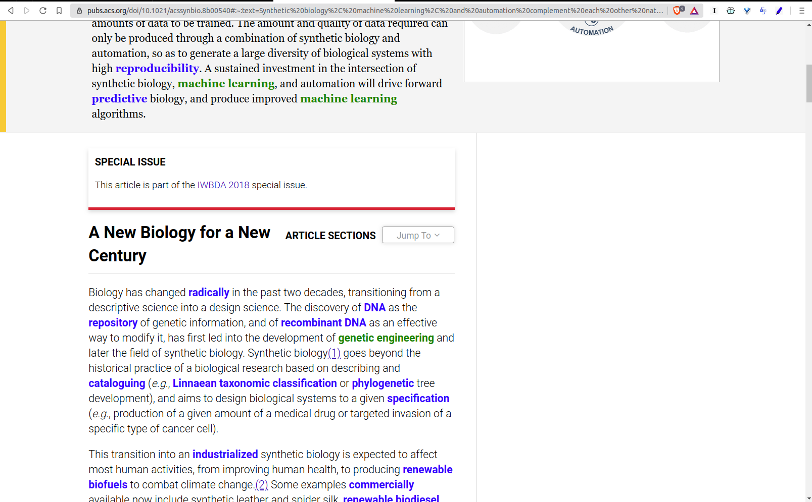

# Chrome Extension: Smart Skim

## Description

If you do a lot of online reading, this is for you.

The aim of this extension is to highlight the important words and phrases in a web article.

A word is assumed to be important if: 
* The frequency with which it usually occurs in the literature is below a threshold (adjustable) 
* It is not found in the dictionary

## Screenshot

## Usage

Extension not published in the webstore.
To use this in your browser, load the "words_discoverer_chrome" folder as an unpacked extension in Chrome/Brave.

Once a web page is loaded, press "Alt+H" to highlight the words on that page.

## Contributors

[mechatroner](https://github.com/mechatroner) - Core functionality  
[XQDD](https://github.com/XQDD) - Text-To-Speech idea and implementation  

[voidcentury](https://github.com/XQDD) - Adaptation to this new purpose